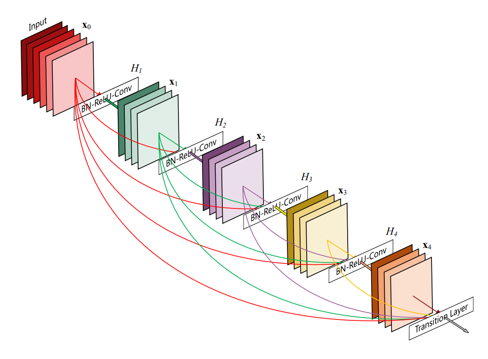
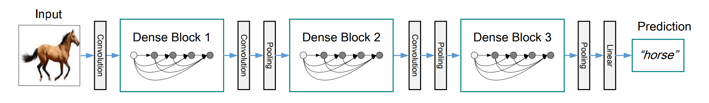
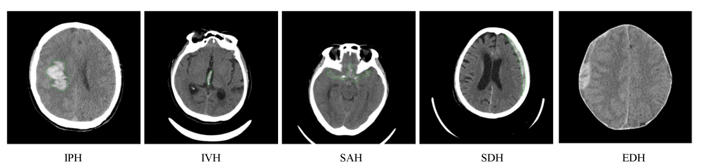
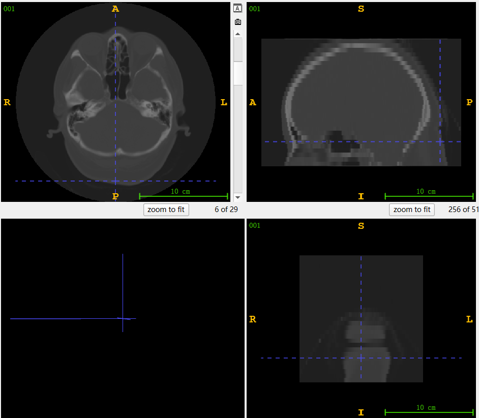

## Abstract

* 基于Viola UNet
* 对颅内出血进行segmentation，预估出血量
* 主要工作：
  * 在原模型的基础上，改进Viola attn，进行预训练
  * 由于原模型未提供detector的densenet，基于torch用ImageNet训练的权重对densenet微调
  * 探究模型对其它数据集的鲁棒性

## TODO

* class ddl：2024.7.30
* Content：
  * Mid-Term Report PPT
  * Final Report PPT
  * Report: conclude docs
  * code: this project

1. 完善主模型预训练，改进为可学习参数，进行实验
2. 鲁班性研究
3. 另一个超参（可做可不做）

## Dir

* docs：
  * analysis of model and code
  * dataset
  * ourwork
  * ......
* Viola-UNet
  * integrated work improved from original code
* mine
  * test
  * pretrain, display, .....


## Usage

* define your file path in ./Viola-Unet/config.py
  * ATTNETION: root file is supposed to be defined correctly
* use main to run


# OURWORK

## detector

### DenseNet

* 网络类似于ResNet，DenseNet将前面所有层与后面层的**密集连接**，通过密集连接（Dense Connectivity）来增强信息流和梯度传播。具体来说，每一层都接收来自所有前面层的特征图，从而实现特征复用和更有效的训练。
* 模型结构：



* 功能：分类



### Impl

* 在本项目中，densenet作用体现在2个方面：
  * 用于CAM：CAM通过特征图可视化，使CNN更具解释性
  * 对颅内出血进行分类：any_ich, edh, iph, ivh, sah, sdh
  * 在detector检测到出血但Viola-Unet并未预测出时，进行修正
  
  
  
* 由于densenet121并未提供预训练参数，我们尝试进行替代

  * torch.densenet121(weights='DEFAULT')：直接使用torch基于ImageNet训练的模型参数
  * 微调：完成了预训练代码，但INSTANCE提供的数据集不包括出血类型信息
  * 改为2分类：是否出现颅内出血
    * 计算label的出血量lesion_volume，得到densenet微调label
    * 相比原模型：丢失了CAM和颅内出血分类功能，但不对segmentation造成影响

### Result

* 由于model预测lesion_volume<0的情况非常少，故该部分对整体影响微乎其微


> reference
>
> * EigenCam: https://blog.csdn.net/qq_36070656/article/details/131740372


## Viola attn

* 该数据集提供的数据特点：横截面CT清晰度高于其它截面



### Viola-Attn

* 改进**viola-attn**计算方式

  * **Origin Viola_attn**：

  ```python
          viola_j = xs * ys + ys * zs + zs * xs       # 0-3
          viola_m = xs * ys * zs                  # 0-1  
          viola_a = self.relu(xt + yt + zt)       # 0-3
  
          viola = viola_j + viola_m + viola_a
          viola = 0.1 * viola + 0.3 
          viola = viola + l2norm(viola.contiguous().view(b,-1)).view(b,c,h,w,d)  
  ```

  * #### Improvement: 增加横截面的权重 & 尝试优化的超参数
    * ##### 修改注意力机制
      * Shortcomings：
        * 如上文，考虑到医学图片可能出现类似一个截面质量明显优于其它的情况，此时若能提高模型对该截面的关注度，能有效提高performance
        * 如果只是单纯加权的话，模型鲁棒性可能较差，如果用于其它Dateset或者其它身体部位，明显依据当前数据集实验出的权重是无效的
      * Solution：为截面加权，并将其设为可学习参数 --> xy_weight...
      > 在增加权重后，涉及到归一化的问题（由于原来通过sigmoid后xs、ys、zs在[0, 1]区间，相乘后仍符合），尝试2种解决方式：
        * 激活函数再处理：sigmoid，tanh（relu）
        * 忽略
  
    * ##### 超参数为何固定
      * `viola = 0.1 * viola + 0.3` 写死了参数，能否调优？
  

  ```python
  # weighted 
  viola_j = xy_weight * xs * ys + yz_weight * ys * zs + xz_weight * zs * xs
  
  # viola_j = activate_func(viola_j)
          
  # alter hyperparameters
  viola = viola_k * viola + viola_b
  ```

### fine-tuning

* 在更改Viola-Attn后，需要对模型微调（或者重新训练）
  * current：仅对截面加权，并未修改超参

### Result

* 仅进行了一次完整的预训练+预测（5.30），params：

  > xy_weight: 0.4*2.5=1
  >
  > yz_weight: 0.3*2.5=7.5
  >
  > xz_weight: 0.3*2.5=7.5
  >
  > activate_again: false
  >
  > viola_k: 0.1
  >
  > viola_b: 0.3

* 效果较之前差别不大：DSC略高，HD几乎相同（RVD，NSD暂未考虑）

## Other dataset
* for Robustness
* 目标：探究当前模型对NIHCC数据集的鲁棒性
* **身体部位不同，往往病变检测方式不同，需要对模型进行微调！！！**


