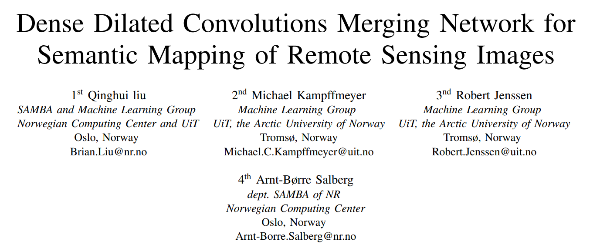
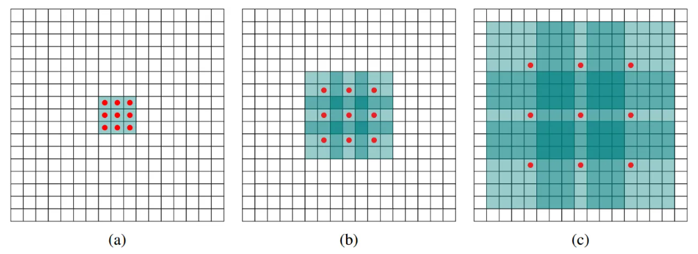
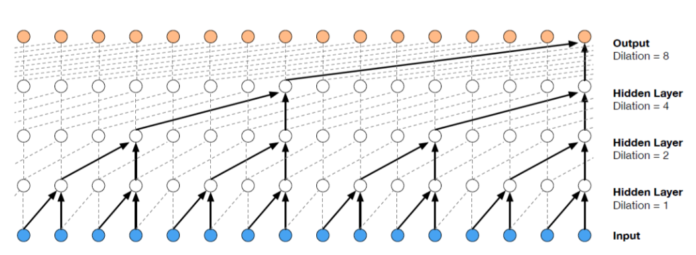
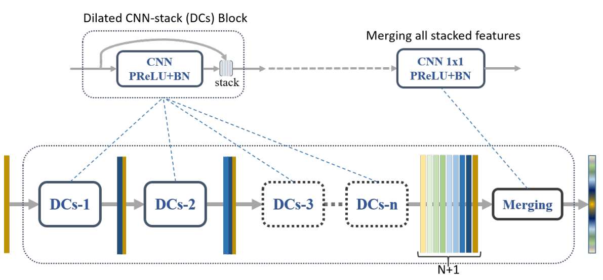
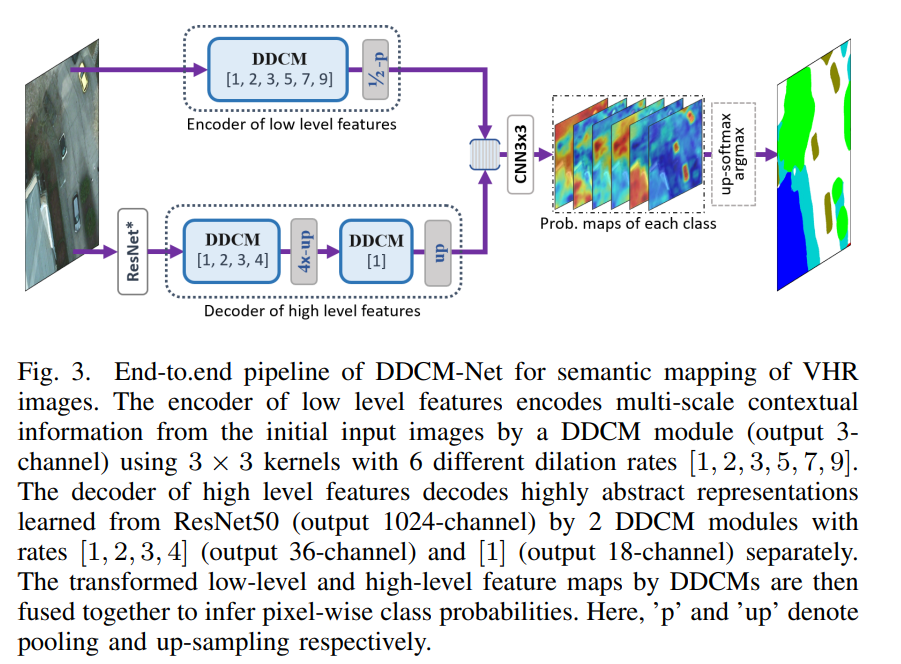

## Methods

### dilated convolutions

* 在图像分割领域，图像输入到CNN，通过**pooling减小图像尺寸增大感受野**，通过**upsampling扩大图像尺寸**，在先减小后增大尺寸的过程中，存在信息损失。故设计**空洞卷积，不进行pooling，但仍可扩大感受野**
* 优势：可灵活调整卷积的感受野（receptive field）来获取多种尺寸的信息，无需进行缩小或扩大操作
* 任务：分类与分割
* 实现：

* 可通过WaveNet结构更好地理解dilated conv

### Dense Dilated Convolutions Merging Module

* 概述：DDCM密集地堆叠各尺寸的特征，再进行合并，可以用更少的参数得到更加准确且更具鲁棒性的表征

* DCs：
  * Dilated CNN stack
  * dilated conv + PReLU + batch normalization（BN）
  * 堆叠（stack）输入与输出：减少 context 信息流失、解决梯度消失问题

* merging：
  * 1 x 1 filter + PReLU + BN 

* DDCM module 实现了：
  * 大感受野
  * 保留输入的图片分辨率不变
  * 模型层数较少

#### Usage

