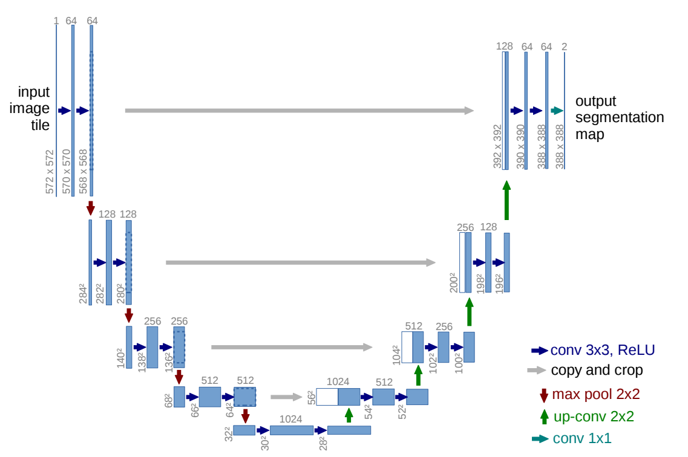

# U-Net

 **(Brief Intro)**

### Structure

* 左半部分：
  * 卷积 + ReLU 提取特征
  * 下采样：每下采样一层，都会把图片减小一半，卷积核数目增加一倍
* 右半部分：
  * 上采样：每上采样一层，都会把图片扩大一倍，卷积核数目减少一半
  * 裁剪拼接：为减少数据丢失，把左边采样时的图片裁剪成相同大小后直接拼接，增加特征层
  * 卷积 + ReLU 提取特征

* 最终结果：在最后一步中，选择了2个1×1的卷积核把64个特征通道变成2个，也就是最后的388×388×2，其实这里就是一个二分类的操作，把图片分成背景和目标两个类别

****

### Understanding

* 通过卷积、上采样、下采样操作，提取图像的目标特征，实现图像的分割
  * 卷积 + pooling（下采样）：降低图像尺寸的同时增大感受野，综合提取该点的特征信息
  * 反卷积（上采样）：由于图像分割预测是pixel wise的输出，故需要将pooling后较小的图片upsampling到原始图像尺寸进行预测