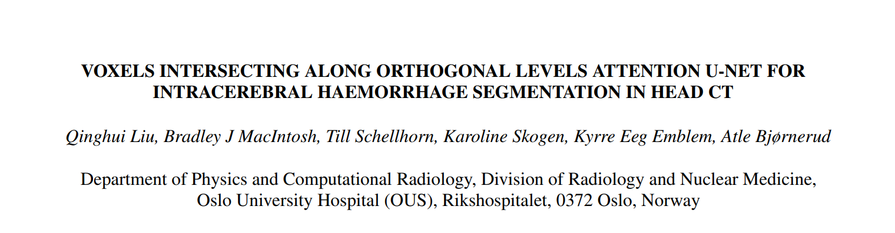
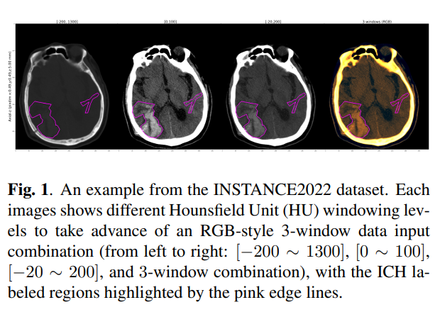
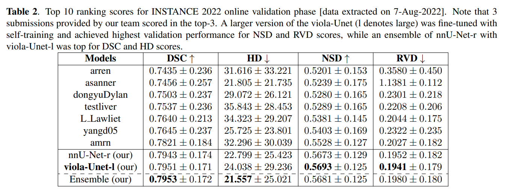
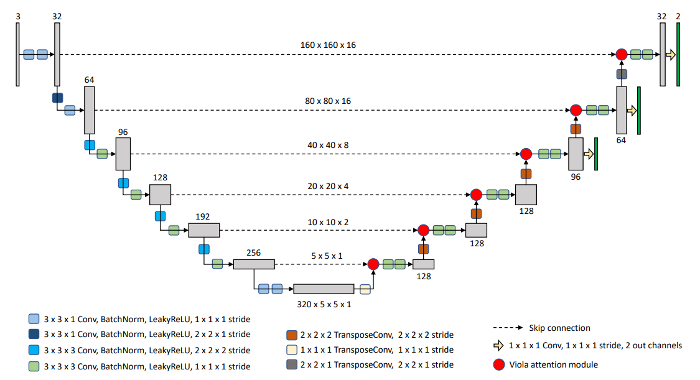
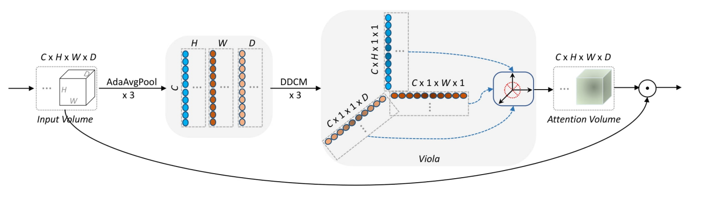
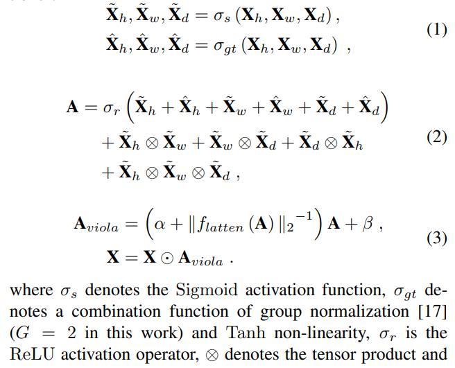
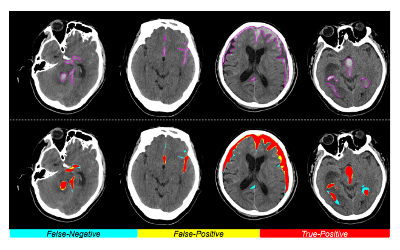
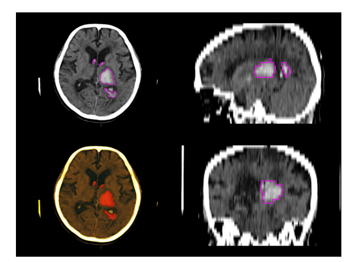

## Keywords

* voxels intersecting：体素相交
* orthogonal：正交
* attention：注意力机制
* U-Net
*  intracranial hemorrhage (ICH)：颅内出血
* segmentation ：分割任务

## Introduction

### Background

* 自发性颅内出血常见，并且属于一种可能致病或致死的严重疾病，ICH流量的准确预测对临床诊断和降低早期死亡率非常重要
* 在临床诊断中，放射科医生可通过 ABC/2 方法计算血肿量（hematoma volume），但该方法存在显著的预测错误，尤其对于不规则的出血（Fig. 1）

* 基于U-Net的模型已经成功实现了对CT扫描颅内出血的分割，类U-Net模型也解决了类似问题

****

### Achievement

* DSC score：0.795

****

### Methods

* 通过 **Viola Attention**，将融合的空间正交和跨信道特征有效地插入到U-Net 解码分支

* 对称的编码解码结构（asymmetric），7层

* 类似 SE 网络
* viola attention module 提取图像特征示意图
  * 沿正交方向纳入特征，有效纳入through-plane 特征
  * **AdaAvgPool**：自适应平均池化，将输入中包含的C（channel），H（height），W（width），D（depth）信息压缩到3个潜在的表征空间：$X_h$，$X_w$，$X_d$​
  * **DDCM**：利用空洞卷积提取图片特征（详细可见 ddcm.md）：结合跨通道信息与 non-local的 上下文信息

* 将上图抽象为公式：

* Moreover：灵活可配置
  * 每一层的卷积步幅（stride）、卷积核大小
  * encoder、decoder的特征数
  * 是否对称

#### Related Work

* U-Net

* Dense dilated convolutions merging（DDCM）

#### Squeeze-and-Excitation（SE）

* 通过清晰地模拟通道与二维特征平面的相互依存关系，重新矫正通道特征响应（channel-wise feature responses）

## Experiment

### Dataset and evaluation metrics

* dataset：INSTANCE 2022, 200 non-contrast 3D head CT scans 
  * sample数非常小：N=200

* metrics：DSC/HD/RVD/NSD ?

### Implementation and training

（现阶段不用关注）

### Result

  > reference:
  >
  > *  SE：https://zhuanlan.zhihu.com/p/349452681
  > *  AdaptiveAvgPool2d :  https://blog.csdn.net/xiyou__/article/details/121287909
  > *  U-Net : https://blog.csdn.net/qq_33924470/article/details/106891015

>Code:
>
>* nnUNet: [MIC-DKFZ/nnUNet (github.com)](https://github.com/MIC-DKFZ/nnUNet/tree/master)
>
>