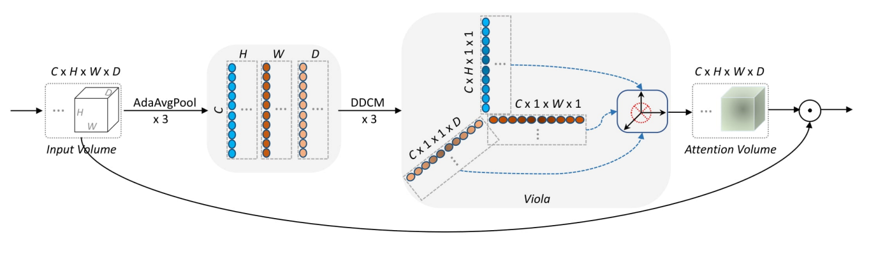

# Viola U-Net Code Analysis:  Viola attn

## Init

（easy to understand）

## Viola attn



* **AdaAvgPool+ DDCM->vx,y,vz**：将信息压缩到表征空间，再用空洞卷积提取特征

* **Sigmoid ->xs,ys,zs**：激活函数处理

* **self.act(torch.cat((vx,vy, vz),3))->vxyz**：连接3个表征，统一进行归一化与激活

* 从处理得到的vxyz中取出原表征对应部分，与**xs/ys/zs** 相加求算数平均 **->xt,yt,zt**

```python
    xt = 0.5 * (vxyz[:, :, :, 0:h] + xs)
    yt = 0.5 * (vxyz[:, :, :, h:h+w] + ys)
    zt = 0.5 * (vxyz[:, :, :, h+w:h+w+d] + zs)
```

* **view -> xs, ys, zs, xt, yt, zt**：统一矩阵维度，方便后续处理

* **Viola_attn**：

```python
		viola_j = xs * ys + ys*zs + zs*xs       # 0-3
        viola_m = xs * ys * zs                  # 0-1  
        viola_a = self.relu(xt + yt + zt)       # 0-3

        viola = viola_j + viola_m + viola_a
        viola = 0.1 * viola + 0.3 
        viola = viola + l2norm(viola.contiguous().view(b,-1)).view(b,c,h,w,d)  
```

* 最后返回：**x * viola**


## Possible Improvement

### Viola attn 机制

* 可以看到当前的 viola attn 机制是相对死板的，我们考虑是否可以通过增加权重，修改运算方式的方法改进viola attn。使其更关注某个表征维度，或者利用Transformer attn的思路使模型关注重点部分
* 超参数的调整：在代码中可以看到非常多的超参数被固定了，如：卷积核、卷积步长、空洞卷积的膨胀率，我们想尝试通过调参的方式使模型更适合当前任务

### 模型的结构

* 之前提过viola模型的一个优势就是灵活可配置，可以调整：

  * U-Net 结构
  * 是否对称
  * .......

  

