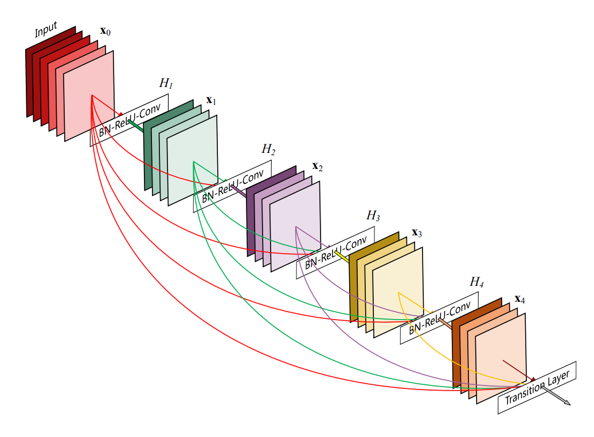
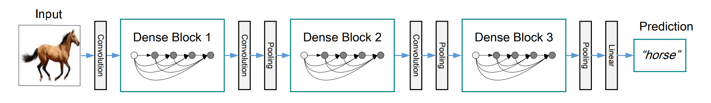

## DenseNet

* 卷积神经网络（**CNN**）

* CVPR2017 Best Paper
* 网络类似于ResNet，DenseNet将前面所有层与后面层的**密集连接**，通过密集连接（Dense Connectivity）来增强信息流和梯度传播。具体来说，每一层都接收来自所有前面层的特征图，从而实现特征复用和更有效的训练。
* 模型结构：



* 功能：分类，输入图像，输出分类结果
  * **输入层**：接受输入图像，例如 224x224 像素的 RGB 图像
  * **卷积层**：通过初始卷积层提取低级特征
  * **密集块（Dense Blocks）**：由多个卷积层组成，每层的输入是所有前面层的特征图的拼接结果。这种结构使得特征在整个网络中得到复用
  * **过渡层（Transition Layers）**：用于连接两个密集块，通常包含卷积和池化操作，用于减少特征图的大小和数量
  * **分类层**：通过全局平均池化层（Global Average Pooling）减少特征图的维度，最终通过全连接层输出分类结果



* 作用：
  * 信息流动更佳：信息高效传递，缓解梯度消失问题
  * 参数更少：通过特征复用减少了冗余特征的计算
  * 特征复用

## DenseNet121


## Appendix

### state_dict()

* 预训练权重文件中的状态字典 (`state_dict`) 是一个包含了模型所有参数（权重和偏置）的Python字典。这个字典的键是模型各层的名称，值是这些层对应的参数张量

* PyTorch中用于保存和加载模型的参数

* code

  * save

  ```python
  torch.save(model.state_dict(), 'saved_path.pth')
  ```

  * load

  ```python
  model.load_state_dict(torch.load('saved_path.pth'))
  ```

* state_dict的作用

  - **模块化**：通过 `state_dict` 可以非常方便地保存和加载模型的参数，而不需要保存整个模型。这使得模型的存储和加载更加灵活和高效。
  - **迁移学习**：使用预训练的 `state_dict` 可以快速加载预训练的权重，进行迁移学习。这使得在新的任务中使用预训练模型变得非常方便。
  - **断点续训**：在训练过程中，可以定期保存 `state_dict`，如果训练被中断，可以从保存的 `state_dict` 恢复训练，而不需要从头开始。
  
  

> reference:
>
> * pytorch source: https://pytorch.org/vision/main/models/generated/torchvision.models.densenet121.html#torchvision.models.DenseNet121_Weights
> * analysis: https://medium.com/deepkapha-notes/implementing-densenet-121-in-pytorch-a-step-by-step-guide-c0c2625c2a60